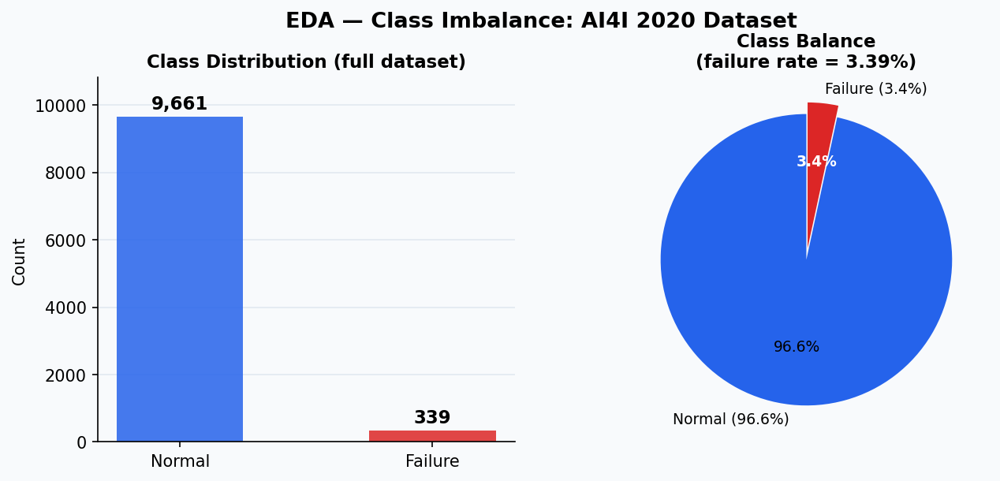
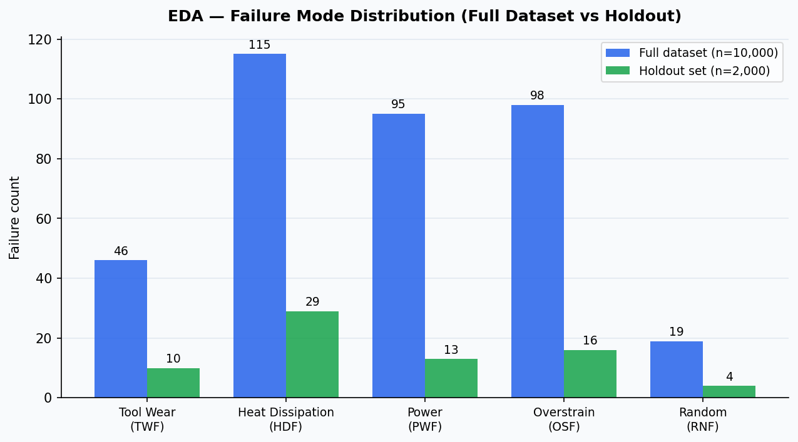
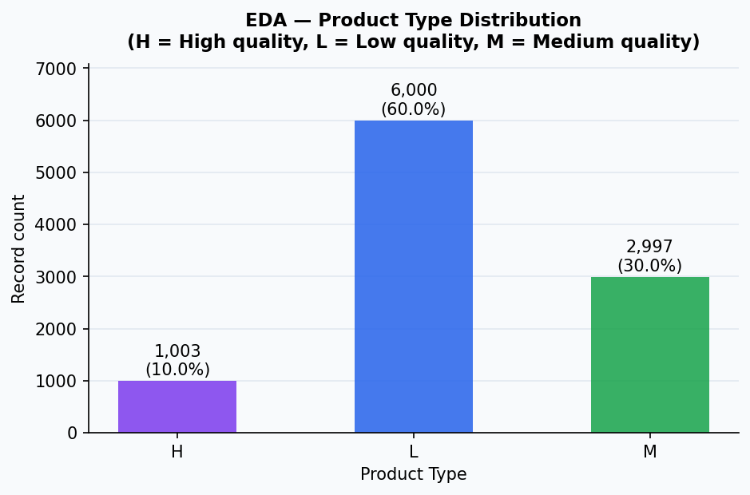
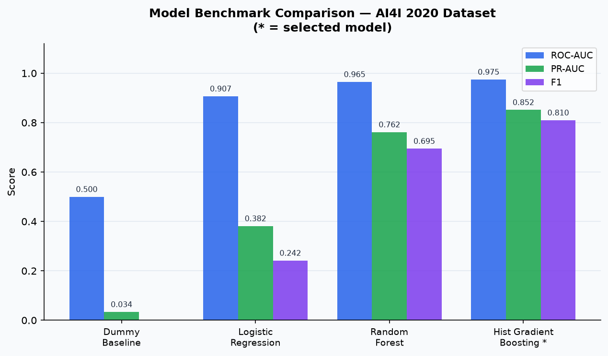
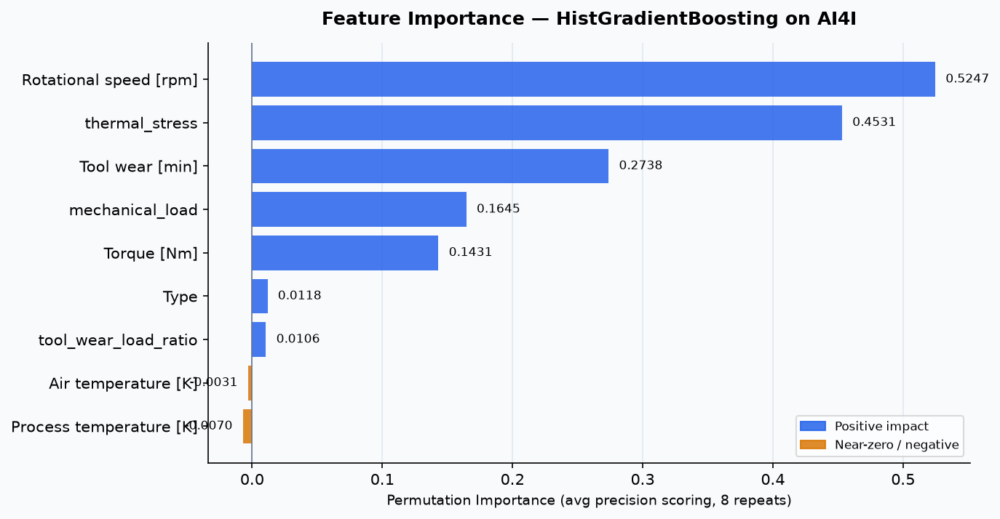
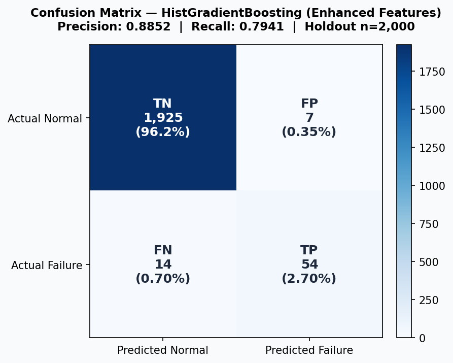
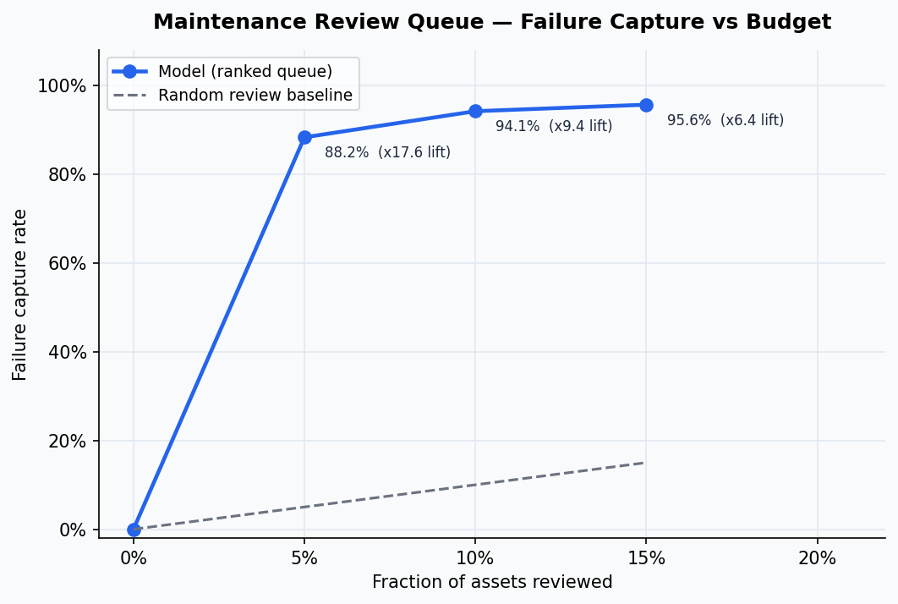

# Smart Factory App

[](https://github.com/senanurcetin/smart-factory-app/actions/workflows/ci.yml)


**Predictive-maintenance analytics case study** — end-to-end ML pipeline on the UCI AI4I 2020 dataset, including EDA, feature engineering, model selection, SQL analysis, review-queue design, and cost framing. Packaged with a Flask plant dashboard.

Demo: [Portfolio project entry](https://senanur-cetin.vercel.app/projects/smart-factory-app)

Short video: [`docs/assets/smart-factory-dashboard.webm`](docs/assets/smart-factory-dashboard.webm)


---

## Problem

Maintenance teams cannot review every asset equally. The question is whether sensor telemetry can be translated into a **ranked work queue** that captures most failures within a limited review budget — and whether that logic can be expressed in terms of cost and business value.

---

## Dataset

| Property | Value |
|----------|-------|
| Source | [UCI AI4I 2020 Predictive Maintenance Dataset](https://archive.ics.uci.edu/dataset/601/ai4i+2020+predictive+maintenance+dataset) |
| Records | 10,000 |
| Failure rate | 3.39% — 339 failures across 9,661 normal records |
| Evaluation | Deterministic 80/20 stratified holdout (seed=42) |
| Raw features | Product type, air temp, process temp, rotational speed, torque, tool wear |

---

## Exploratory Data Analysis

### Class imbalance

The dataset is heavily imbalanced at 3.39% failure rate. Accuracy is a misleading metric here; PR-AUC and recall are the correct evaluation signals.



### Failure mode distribution

Heat dissipation (HDF) and overstrain (OSF) are the most frequent failure types. Random failures (RNF) are rare and poorly separable — an honest limitation of the benchmark.



### Product type distribution

Type L (low quality) makes up 60% of records. Type H (high quality) is the smallest slice at 10%.



---

## Feature Engineering

Three cross-sensor features were derived to capture interaction effects that individual raw sensors cannot express:

| Derived feature | Formula | Intuition |
|-----------------|---------|-----------|
| `mechanical_load` | Torque x RPM | Proxy for power delivered to the spindle |
| `thermal_stress` | (Process temp - Air temp) / Air temp | Relative thermal load under operating conditions |
| `tool_wear_load_ratio` | Tool wear / Torque | Wear rate per unit of mechanical load |

These features improve the final model: ROC-AUC 0.9686 to **0.9819**, PR-AUC 0.8522 to **0.8855**.

---

## Model Selection

Four models benchmarked on the holdout using the **raw feature set** (before derived features):



| Model | ROC-AUC | PR-AUC | F1 |
|-------|---------|--------|----|
| Dummy baseline | 0.500 | 0.034 | 0.000 |
| Logistic regression | 0.907 | 0.382 | 0.242 |
| Random forest | 0.961 | 0.772 | 0.717 |
| **HistGradientBoosting** (selected) | **0.969** | **0.852** | **0.803** |

HistGradientBoosting selected for highest PR-AUC and F1 on the imbalanced holdout.

---

## Feature Importance

Permutation importance (average precision scoring, 8 repeats) on the final enhanced model:



Rotational speed and `thermal_stress` dominate. Derived features rank in the top 5, validating the feature engineering step.

---

## Final Model Performance

After adding derived features, HistGradientBoosting achieves:

| Metric | Value |
|--------|-------|
| ROC-AUC | **0.9819** |
| PR-AUC | **0.8855** |
| Precision | **0.8852** |
| Recall | **0.7941** |
| F1 | **0.8372** |
| Calibration ECE | 0.0017 (well-calibrated) |

### Confusion matrix



Out of 68 actual failures in the holdout: **54 correctly flagged (TP)**, 14 missed (FN), only 7 false alarms (FP).

---

## SQL Analysis

Analytical queries run with **DuckDB** directly on the pre-computed JSON artifacts. Results saved to [`docs/data/ai4i-case-study/sql-analysis.json`](docs/data/ai4i-case-study/sql-analysis.json).

**Q1 — Failure modes ranked by frequency and capture rate:**

| Code | Label | Holdout failures | Capture rate at top 10% |
|------|-------|-----------------|------------------------|
| HDF | Heat dissipation | 29 | 100% |
| OSF | Overstrain | 16 | 100% |
| PWF | Power failure | 13 | 100% |
| TWF | Tool wear | 10 | 70% |
| RNF | Random | 4 | 25% |

RNF has the lowest separability — acknowledged as a model limitation.

**Q2 — Models ranked by PR-AUC (correct metric for imbalanced data):**

HistGradientBoosting 0.852 > RandomForest 0.772 > LogisticRegression 0.382 > Dummy 0.034

**Q3 — Review queue ROI:**

| Budget | Failures caught | Yield lift | Assets per failure caught |
|--------|----------------|-----------|--------------------------|
| 5% — 100 assets | 88.2% | 17.7x | 1.7 |
| 10% — 200 assets | 94.1% | 9.4x | 3.1 |
| 15% — 300 assets | 95.6% | 6.4x | 4.6 |

---

## Maintenance Review Queue



Reviewing the **top 10% of assets** (200 machines) captures **94.1% of all holdout failures** — 9.4x better than random review.

---

## Cost Impact

From [`docs/data/ai4i-case-study/cost-simulation.json`](docs/data/ai4i-case-study/cost-simulation.json):

| Scenario | Cost |
|----------|------|
| Reactive maintenance (no model) | $238,000 |
| Random review | $224,000 |
| Risk-ranked queue (top 10%) | $53,000 |
| **Savings vs reactive** | **$185,000 (77.7%)** |

Assumptions are illustrative — demonstrates how model output translates into maintenance economics.

---

## Stack

| Layer | Technology |
|-------|-----------|
| Application | Python 3.11, Flask |
| Analytics | Pandas, NumPy, SciPy, scikit-learn |
| SQL analysis | DuckDB (in-memory, reads JSON natively) |
| Visualization | Matplotlib |
| Frontend | HTML, CSS, JavaScript |
| CI | GitHub Actions |

---

## Architecture

```
smart-factory-app/
├── analysis/
│   ├── run_ai4i_case_study.py   # Full ML pipeline (downloads UCI dataset on first run)
│   ├── generate_visuals.py      # Model comparison, feature importance, review queue curve
│   ├── generate_eda.py          # EDA charts: class balance, failure modes, confusion matrix
│   └── sql_queries.py           # DuckDB SQL analysis on JSON artifacts
├── docs/
│   ├── assets/                  # All PNG charts (9 files)
│   ├── data/ai4i-case-study/    # JSON artifacts + sql-analysis.json
│   ├── case-study.md
│   └── hiring-summary.md
├── tests/
│   ├── test_case_study.py       # Route and integration tests
│   └── test_artifacts.py        # Data quality, metrics range, asset presence (27 tests)
├── main.py
├── case_study.py
└── requirements.txt
```

---

## Local Setup

```bash
python -m venv .venv
# Windows:  .venv\Scripts\activate
# macOS/Linux:  source .venv/bin/activate

pip install -r requirements.txt

# Generate all charts from JSON artifacts (no dataset download needed)
python analysis/generate_eda.py
python analysis/generate_visuals.py

# Run SQL analysis
python analysis/sql_queries.py

# Run full ML benchmark (downloads UCI dataset ~500 KB on first run)
python analysis/run_ai4i_case_study.py

# Start the dashboard
python main.py
```

App: `http://127.0.0.1:8080` | Case-study route: `http://127.0.0.1:8080/case-study`

---

## Tests

```bash
# All 27 tests: routes, artifact contracts, metrics thresholds, chart file presence
python -m unittest discover -s tests -v

# Syntax check all modules
python -m py_compile main.py case_study.py \
    analysis/run_ai4i_case_study.py \
    analysis/generate_visuals.py \
    analysis/generate_eda.py \
    analysis/sql_queries.py
```

---

## Proof Surfaces

| Document | Contents |
|----------|----------|
| [`docs/case-study.md`](docs/case-study.md) | Full methodology, results, limitations |
| [`docs/hiring-summary.md`](docs/hiring-summary.md) | Recruiter-facing one-page summary |
| [`docs/data/ai4i-case-study/summary.json`](docs/data/ai4i-case-study/summary.json) | Final model metrics and confusion matrix |
| [`docs/data/ai4i-case-study/sql-analysis.json`](docs/data/ai4i-case-study/sql-analysis.json) | DuckDB query results |
| Local route | `http://127.0.0.1:8080/case-study` |

---

## What This Proves

- Class imbalance identified up front; PR-AUC and recall drive metric selection throughout
- Feature engineering adds measurable, documented value (ROC +0.013, PR-AUC +0.033)
- SQL proficiency: DuckDB analytical queries on structured JSON artifacts
- Model output translated into a ranked maintenance queue with quantified business ROI
- End-to-end analytical thinking: EDA to feature engineering to model selection to business framing

---

## Limitations

- The UCI AI4I dataset is simulated — metrics are benchmark evidence, not plant-specific deployment claims
- The live dashboard uses synthetic telemetry, not a deployed production stream
- The cost model is illustrative; real maintenance economics vary by plant and equipment type
- Random failures (RNF) have low separability — 25% capture rate is an acknowledged limitation

---

## License

MIT
