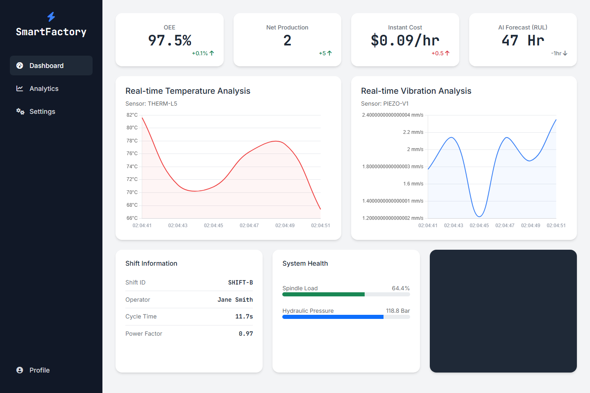

# Smart Factory App

Smart Factory App is an Industry 4.0 dashboard prototype for predictive maintenance, OEE monitoring, and production analytics. It blends machine-health data, operational KPIs, and lightweight machine learning into a single manufacturing view.

Demo: [Portfolio project entry](https://senanur-cetin.vercel.app/projects/smart-factory-app)

Short video demo: [`docs/assets/smart-factory-dashboard.webm`](docs/assets/smart-factory-dashboard.webm)



Portfolio role: `support case study`

## Why this project exists

Predictive-maintenance demos often stop at a model score or a generic chart. Plant teams, however, need machine signals, KPI context, and maintenance-oriented prioritization in the same surface. Smart Factory App exists to show how predictive logic can be made legible to operations and maintenance reviewers.

## Case-study frame

### Problem

Machine-health indicators, production KPIs, and maintenance context are often reviewed separately even though plant decisions need them together.

### Business context

For a maintenance or plant-analytics reviewer, the useful question is whether telemetry can be translated into prioritization and planning signals, not whether a dashboard merely looks polished.

### Data or signal source

The application simulates six machine-health features plus MES-style context such as OEE, cycle time, shift ownership, event logs, and energy cost.

### Workflow and logic approach

The app trains a lightweight Random Forest model on synthetic telemetry and places the risk score next to OEE, RUL, cost-per-hour, and event context in one dashboard flow.

### Evaluation and key metrics

- **Machine signals:** temperature, vibration, current, pressure, RPM, and energy
- **Maintenance-facing KPIs:** OEE, RUL, cost per hour, shift context
- **Decision-support surface:** risk score plus event log
- **Model role:** lightweight support logic rather than a production benchmark

### Operational outcome

The result is a support case study that shows how predictive-maintenance ideas can be packaged into a plant-facing KPI and maintenance workflow.

## What it does

- Simulates live machine data for temperature, vibration, current, pressure, RPM, and energy.
- Estimates failure risk with a Random Forest model.
- Tracks operational metrics such as OEE, cycle time, and shift performance.
- Presents the data in a dashboard-oriented layout designed for manufacturing use cases.

## Stack

- Python
- Flask
- Pandas
- NumPy
- scikit-learn
- HTML, CSS, JavaScript

## Architecture snapshot

- **Application shell:** single-file Flask dashboard for plant-facing analytics
- **Signal layer:** synthetic machine telemetry and MES-style operational context
- **Model layer:** lightweight Random Forest classifier for failure-risk estimation
- **KPI layer:** OEE, RUL, cost-per-hour, shift context, and event-log surfaces
- **Deployment shape:** lightweight local or free-tier Flask demo

## What this proves

- You can combine telemetry, KPI logic, and a lightweight ML layer in one manufacturing surface.
- You understand how predictive-maintenance concepts should be packaged for plant teams rather than left as isolated modeling artifacts.
- You can bridge operations language and DS language without losing the industrial context.

## Local setup

```bash
python -m venv .venv
.venv\\Scripts\\activate
pip install -r requirements.txt
python main.py
```

The app runs on `http://127.0.0.1:8080`.

## Quality checks

```bash
python -m py_compile main.py
python -c "import main; print(main.app.name)"
```

These are the same smoke checks enforced in GitHub Actions.

## Limitations

- The current model is trained on synthetic data and should be read as workflow packaging rather than a production benchmark.
- The strongest value is in KPI framing and maintenance-oriented decision support, not in model novelty.

## Portfolio note

This repository is a predictive-maintenance support case study. It is intended to show plant analytics, KPI framing, and manufacturing-oriented software packaging rather than heavyweight infrastructure or production deployment.

## License

MIT
