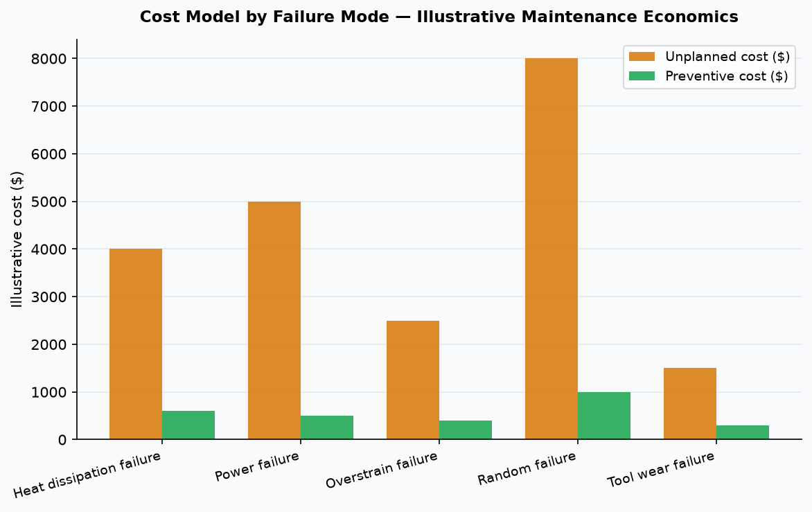
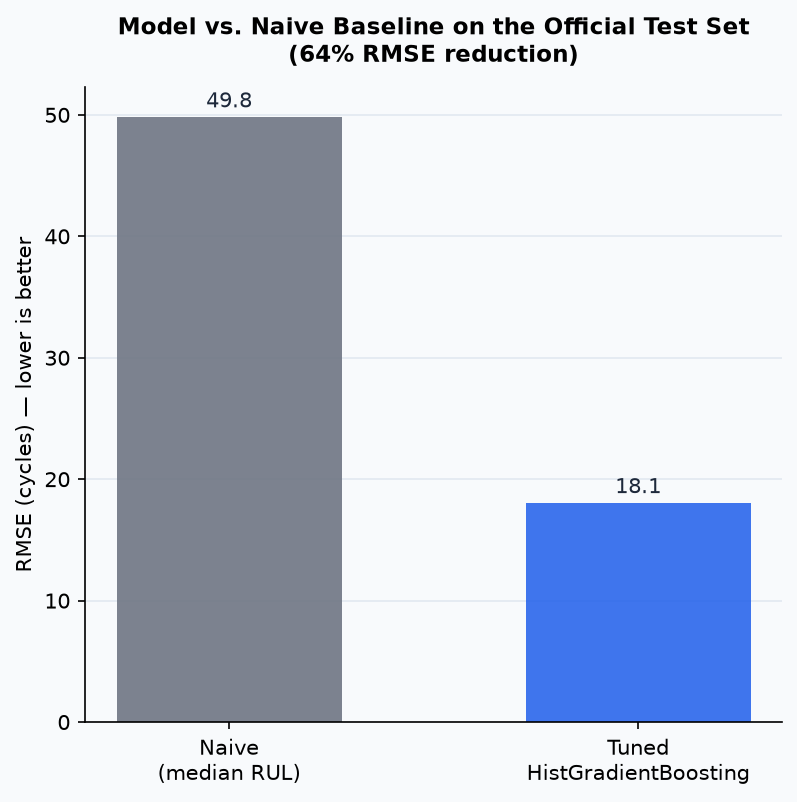
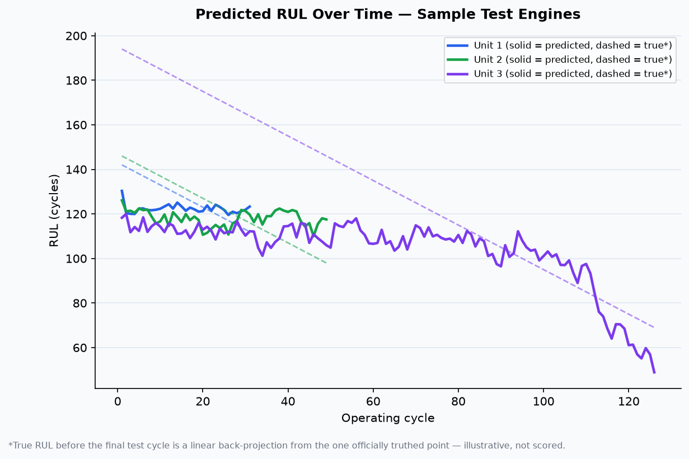

# Smart Factory App

[](https://github.com/senanurcetin/smart-factory-app/actions/workflows/ci.yml)


**Predictive-maintenance analytics case study** — end-to-end ML pipeline on the UCI AI4I 2020 dataset, including EDA, feature engineering, model selection, SQL analysis, review-queue design, and cost framing. Packaged with a Flask plant dashboard, plus a [second case study](#rul-regression-nasa-c-mapss) demonstrating genuine remaining-useful-life (RUL) regression on NASA's C-MAPSS run-to-failure dataset.

Demo: [Portfolio project entry](https://senanur-cetin.vercel.app/projects/smart-factory-app)

Short video: [`docs/assets/smart-factory-dashboard.webm`](docs/assets/smart-factory-dashboard.webm)


---

## Live Demo

Not yet deployed to a persistent URL. One-click path using the `render.yaml` blueprint already committed in this repo:

1. Sign up at [render.com](https://render.com) (free tier is enough).
2. **New +** → **Blueprint** → connect this GitHub repo. Render auto-detects `render.yaml` and the existing multi-stage `Dockerfile` — no manual configuration needed.
3. First deploy takes a few minutes (installs the full scientific-Python stack: scikit-learn, scipy, pandas, shap, duckdb, matplotlib). Later deploys are faster via layer caching.
4. Free-tier services spin down after ~15 minutes idle; the first request after that takes ~30-60 seconds to wake up — a known free-tier tradeoff, not a bug.
5. Once live: update this line and the [portfolio entry](https://senanur-cetin.vercel.app/projects/smart-factory-app) above with the real URL.

**Why not Vercel for the interactive app**: Vercel's serverless Python functions have a size limit (~250MB unzipped) that this repo's dependency stack is very likely to exceed. Render (and similarly Fly.io/Cloud Run) run the app as a real container instead of a size-constrained function — a better fit here, and it reuses the Dockerfile already built and CI-verified in this repo rather than needing a separate, trimmed-down deployment path.

---

## Problem

Maintenance teams cannot review every asset equally. The question is whether sensor telemetry can be translated into a **ranked work queue** that captures most failures within a limited review budget — and whether that logic can be expressed in terms of cost and business value.

---

## Dataset

| Property | Value |
|----------|-------|
| Source | [UCI AI4I 2020 Predictive Maintenance Dataset](https://archive.ics.uci.edu/dataset/601/ai4i+2020+predictive+maintenance+dataset) |
| Records | 10,000 |
| Failure rate | 3.39% — 339 failures across 9,661 normal records |
| Evaluation | Deterministic 80/20 stratified holdout (seed=42) |
| Raw features | Product type, air temp, process temp, rotational speed, torque, tool wear |

---

## Exploratory Data Analysis

### Class imbalance

The dataset is heavily imbalanced at 3.39% failure rate. Accuracy is a misleading metric here; PR-AUC and recall are the correct evaluation signals.


### Failure mode distribution

Heat dissipation (HDF) and overstrain (OSF) are the most frequent failure types. Random failures (RNF) are rare and poorly separable — an honest limitation of the benchmark.


### Product type distribution

Type L (low quality) makes up 60% of records. Type H (high quality) is the smallest slice at 10%.


---

## Feature Engineering

Three cross-sensor features were derived to capture interaction effects that individual raw sensors cannot express:

| Derived feature | Formula | Intuition |
|-----------------|---------|-----------|
| `mechanical_load` | Torque x RPM | Proxy for power delivered to the spindle |
| `thermal_stress` | (Process temp - Air temp) / Air temp | Relative thermal load under operating conditions |
| `tool_wear_load_ratio` | Tool wear / Torque | Wear rate per unit of mechanical load |

Isolated impact (same tuned hyperparameters, raw vs. enhanced features, so the delta is attributable to the three derived features alone): ROC-AUC **+0.018**, PR-AUC **+0.077**, F1 **+0.082**.

---

## Model Selection

Four models benchmarked on the holdout using the **raw feature set** (before derived features):


| Model | ROC-AUC | PR-AUC | F1 |
|-------|---------|--------|----|
| Dummy baseline | 0.500 | 0.034 | 0.000 |
| Logistic regression | 0.907 | 0.382 | 0.242 |
| Random forest | 0.965 | 0.762 | 0.695 |
| **HistGradientBoosting** (selected) | **0.975** | **0.852** | **0.810** |

HistGradientBoosting selected for highest PR-AUC and F1 on the imbalanced holdout. This table uses raw features and default hyperparameters for a fair four-model comparison; the deployed model additionally adds the derived features above and a tuned hyperparameter search (see [Final Model Performance](#final-model-performance)).

---

## Feature Importance

Permutation importance (average precision scoring, 8 repeats) on the final enhanced model:


Rotational speed and `thermal_stress` dominate. Derived features rank in the top 5, validating the feature engineering step.

---

## Final Model Performance

HistGradientBoosting with derived features and a tuned hyperparameter search (`max_leaf_nodes=15`, `learning_rate=0.03`, `l2_regularization=1.0`, unrestricted `max_depth`; see [Hyperparameter Tuning](#hyperparameter-tuning)) achieves:

| Metric | Value |
|--------|-------|
| ROC-AUC | **0.9874** |
| PR-AUC | **0.9019** |
| Precision | **0.9273** |
| Recall | **0.75** |
| F1 | **0.8293** |
| Calibration ECE | 0.007 (well-calibrated) |

### Confusion matrix


Out of 68 actual failures in the holdout: **51 correctly flagged (TP)**, 17 missed (FN), only 4 false alarms (FP). Tuning traded some recall for precision relative to the untuned model — see the Hyperparameter Tuning section for why PR-AUC (threshold-independent) was used as the search objective instead of F1.

---

## Hyperparameter Tuning

The deployed model's hyperparameters were selected with `RandomizedSearchCV` (20 iterations, 5-fold stratified CV, scored on PR-AUC — the same primary metric used everywhere else in this repo) over `max_depth`, `learning_rate`, `l2_regularization`, and `max_leaf_nodes`. Full search config and results: [`docs/data/ai4i-case-study/model-selection.json`](docs/data/ai4i-case-study/model-selection.json).

---

## Explainability (SHAP)

Local feature attribution for the top 10 highest-risk holdout predictions uses `shap.TreeExplainer` (interventional, probability-space) rather than a single-feature-ablation heuristic, so it correctly accounts for feature interactions (e.g. torque and tool wear jointly driving overstrain risk). Detail: [`docs/data/ai4i-case-study/feature-importance.json`](docs/data/ai4i-case-study/feature-importance.json) → `local_attributions_top10_high_risk`.

---

## Validation Robustness

AI4I 2020 has no time axis or repeated-asset grouping — each of the 10,000 rows is one independently sampled machine snapshot with a unique Product ID — so time-aware or group-based (`GroupKFold`) splitting is not applicable to this dataset. Instead, the final architecture was re-fit across 5 independent stratified 80/20 splits to confirm the headline metrics aren't an artifact of one lucky split:

**ROC-AUC 0.984 ± 0.004, PR-AUC 0.880 ± 0.032** across seeds. PR-AUC varies more than ROC-AUC across splits (expected — only ~68 failures land in each 20% holdout), so the single-split PR-AUC of 0.90 reported above sits on the higher end of that range rather than being a guaranteed number. Full per-seed results: [`docs/data/ai4i-case-study/validation-robustness.json`](docs/data/ai4i-case-study/validation-robustness.json).

---

## SQL Analysis

Analytical queries run with **DuckDB** directly on the pre-computed JSON artifacts. Results saved to [`docs/data/ai4i-case-study/sql-analysis.json`](docs/data/ai4i-case-study/sql-analysis.json).

**Q1 — Failure modes ranked by frequency and capture rate:**

| Code | Label | Holdout failures | Capture rate at top 10% |
|------|-------|-----------------|------------------------|
| HDF | Heat dissipation | 29 | 100% |
| OSF | Overstrain | 16 | 100% |
| PWF | Power failure | 13 | 100% |
| TWF | Tool wear | 10 | 70% |
| RNF | Random | 4 | 25% |

RNF has the lowest separability — acknowledged as a model limitation.

**Q2 — Models ranked by PR-AUC (correct metric for imbalanced data):**

HistGradientBoosting 0.852 > RandomForest 0.762 > LogisticRegression 0.382 > Dummy 0.034

**Q3 — Review queue ROI:**

| Budget | Failures caught | Yield lift | Assets per failure caught |
|--------|----------------|-----------|--------------------------|
| 5% — 100 assets | 89.7% | 17.9x | 1.6 |
| 10% — 200 assets | 94.1% | 9.4x | 3.1 |
| 15% — 300 assets | 95.6% | 6.4x | 4.6 |

---

## Maintenance Review Queue


Reviewing the **top 10% of assets** (200 machines) captures **94.1% of all holdout failures** — 9.4x better than random review.

---

## Cost Impact

From [`docs/data/ai4i-case-study/cost-simulation.json`](docs/data/ai4i-case-study/cost-simulation.json):

| Scenario | Cost |
|----------|------|
| Reactive maintenance (no model) | $238,000 |
| Random review | $224,000 |
| Risk-ranked queue (top 10%) | $53,000 |
| **Savings vs reactive** | **$185,000 (77.7%)** |

Assumptions are illustrative — demonstrates how model output translates into maintenance economics.



Per-failure-mode cost breakdown (differentiated unplanned vs. preventive cost per mode): [`docs/data/ai4i-case-study/cost-model.json`](docs/data/ai4i-case-study/cost-model.json).

---

## RUL Regression (NASA C-MAPSS)

A **second, separate case study**. AI4I 2020 is a static snapshot dataset — one row per independently sampled machine, no time axis — so it cannot support genuine remaining-useful-life (RUL) regression. NASA's C-MAPSS turbofan degradation dataset is a real run-to-failure dataset, which makes real RUL regression possible, and its multi-cycle-per-engine structure also supports a proper **grouped** train/validation split (`GroupKFold` by engine) — the exact rigor technique AI4I's structure could not support.

| Metric | Naive baseline (median RUL) | Tuned model |
|--------|------------------------------|-------------|
| RMSE (cycles) | 49.82 | **18.05** |
| PHM08 score | 166,570.5 | **837.6** |

**63.8% RMSE reduction** over the naive baseline, evaluated on NASA's own official test protocol (not a custom split) — an RMSE of ~18 cycles is consistent with published classical-ML results on this benchmark (FD001).




Full methodology, feature engineering, evaluation protocol, and limitations: [`docs/rul-case-study.md`](docs/rul-case-study.md). Live results page: `/rul-case-study` (linked from the dashboard sidebar). Raw artifacts: [`docs/data/cmapss-rul-case-study/`](docs/data/cmapss-rul-case-study/).

*The live bento dashboard's own RUL tile intentionally stays a simple heuristic derived from the AI4I risk score — see [Engineering Decisions](#engineering-decisions) for why.*

---

## Stack

| Layer | Technology |
|-------|-----------|
| Application | Python 3.11, Flask, gunicorn |
| Deployment | Docker (multi-stage build) |
| Analytics | Pandas, NumPy, SciPy, scikit-learn |
| Explainability | SHAP (TreeExplainer) |
| SQL analysis | DuckDB (in-memory, reads JSON natively) |
| Visualization | Matplotlib |
| Frontend | HTML, CSS, JavaScript |
| CI | GitHub Actions |

---

## Architecture

```
smart-factory-app/
├── analysis/
│   ├── _common.py                     # Shared helpers (to_float, write_json, model card)
│   ├── run_ai4i_case_study.py         # AI4I ML pipeline (downloads UCI dataset on first run)
│   ├── generate_visuals.py            # Model comparison, feature importance, review queue, cost model
│   ├── generate_eda.py                # EDA charts: class balance, failure modes, confusion matrix
│   ├── sql_queries.py                 # DuckDB SQL analysis on JSON artifacts
│   ├── run_cmapss_rul_case_study.py   # RUL regression pipeline (downloads NASA dataset on first run)
│   ├── generate_cmapss_visuals.py     # RUL trajectory, predicted-vs-actual, feature importance charts
│   └── artifacts/                     # Persisted pipelines — also scored live by main.py
│       ├── model.pkl                  # AI4I classifier
│       └── rul_model.pkl              # C-MAPSS RUL regressor
├── docs/
│   ├── assets/                        # All chart/media assets (14 files)
│   ├── data/ai4i-case-study/          # AI4I JSON artifacts + sql-analysis.json
│   ├── data/cmapss-rul-case-study/    # RUL JSON artifacts
│   ├── case-study.md
│   └── rul-case-study.md
├── tests/
│   ├── test_case_study.py             # AI4I route and integration tests
│   ├── test_dashboard_model.py        # Live dashboard scores against the real trained pipeline
│   ├── test_artifacts.py              # AI4I data quality, metrics range, asset presence (35 tests)
│   ├── test_rul_case_study.py         # RUL route and integration tests
│   └── test_rul_artifacts.py          # RUL data quality and metrics contract tests
├── main.py
├── case_study.py
├── rul_case_study.py
├── Dockerfile                         # Multi-stage build, served via gunicorn
├── render.yaml                        # One-click Render Blueprint (Docker runtime)
├── requirements.txt
└── requirements-dev.txt               # + ruff, black
```

---

## Local Setup

```bash
python -m venv .venv
# Windows:  .venv\Scripts\activate
# macOS/Linux:  source .venv/bin/activate

pip install -r requirements-dev.txt   # or requirements.txt if you don't need lint/format tooling

# Generate all charts from JSON artifacts (no dataset download needed)
python analysis/generate_eda.py
python analysis/generate_visuals.py

# Run SQL analysis
python analysis/sql_queries.py

# Run full AI4I ML benchmark (downloads UCI dataset ~500 KB on first run).
# This also persists the final pipeline to analysis/artifacts/model.pkl,
# which main.py loads to score the live dashboard — a pre-trained copy is
# already committed, so this step is optional unless you want to retrain.
python analysis/run_ai4i_case_study.py

# Run the RUL regression case study (downloads NASA C-MAPSS dataset ~12 MB
# on first run). Persists analysis/artifacts/rul_model.pkl — also optional,
# a pre-trained copy is already committed.
python analysis/run_cmapss_rul_case_study.py
python analysis/generate_cmapss_visuals.py

# Start the dashboard (scores simulated AI4I-schema telemetry with the
# real trained pipeline above — not a separate toy model)
python main.py
```

App: `http://127.0.0.1:8080` | Case-study route: `http://127.0.0.1:8080/case-study` | RUL case-study route: `http://127.0.0.1:8080/rul-case-study`

---

## Docker

```bash
docker build -t smart-factory-app .
docker run -p 8080:8080 smart-factory-app
```

Multi-stage build, served by `gunicorn` (2 workers) instead of the Flask development server. The committed `analysis/artifacts/model.pkl` and `rul_model.pkl` are both baked into the image, so no dataset download or retraining is needed to run the container. Built and smoke-tested on every push via the `docker` job in CI ([`.github/workflows/ci.yml`](.github/workflows/ci.yml)).

---

## Tests

```bash
# All 62 tests: routes, artifact contracts, metrics thresholds, chart file
# presence, hyperparameter-tuning/validation-robustness/model-card contracts,
# live dashboard <-> real model integration, and the RUL case study's own
# artifact contracts and routes
python -m unittest discover -s tests -v

# Lint and format check
ruff check .
black --check .

# Syntax check all modules
python -m py_compile main.py case_study.py rul_case_study.py \
    analysis/run_ai4i_case_study.py \
    analysis/generate_visuals.py \
    analysis/generate_eda.py \
    analysis/sql_queries.py \
    analysis/run_cmapss_rul_case_study.py \
    analysis/generate_cmapss_visuals.py
```

---

## Proof Surfaces

| Document | Contents |
|----------|----------|
| [`docs/case-study.md`](docs/case-study.md) | Full methodology, results, limitations (AI4I) |
| [`docs/rul-case-study.md`](docs/rul-case-study.md) | Full methodology, results, limitations (C-MAPSS RUL) |
| [`docs/data/ai4i-case-study/summary.json`](docs/data/ai4i-case-study/summary.json) | Final model metrics and confusion matrix |
| [`docs/data/ai4i-case-study/sql-analysis.json`](docs/data/ai4i-case-study/sql-analysis.json) | DuckDB query results |
| [`docs/data/cmapss-rul-case-study/summary.json`](docs/data/cmapss-rul-case-study/summary.json) | RUL model RMSE, PHM08 score, baseline comparison |
| [`docs/data/ai4i-case-study/drift-report.json`](docs/data/ai4i-case-study/drift-report.json) | PSI drift-check results (real, CI-executed, not just documented) |
| Local route | `http://127.0.0.1:8080/case-study` |
| Local route | `http://127.0.0.1:8080/rul-case-study` |

---

## Skills Demonstrated

- **Exploratory data analysis**: class imbalance identification, failure mode profiling, product type distribution
- **Feature engineering**: derived cross-sensor features (`mechanical_load`, `thermal_stress`, `tool_wear_load_ratio`), with impact isolated from hyperparameter tuning via a controlled comparison
- **Hyperparameter tuning**: `RandomizedSearchCV` with PR-AUC as the search objective, results logged transparently
- **Explainability**: SHAP TreeExplainer for interaction-aware local attribution, not a single-feature heuristic
- **Validation rigor**: repeated stratified holdouts to confirm metric stability where time-aware/group splitting isn't applicable
- **Model selection**: four-model benchmark with PR-AUC as primary metric for imbalanced data
- **SQL**: DuckDB analytical queries on JSON artifacts — failure mode ranking, model comparison, queue ROI
- **Business framing**: ranked review queue, cost model, operational maintenance economics
- **Engineering practice**: pinned dependencies, lint/format CI gate, structured logging, a minimal model card, model persisted via joblib and served (not retrained ad hoc) by the live app
- **Deployment**: multi-stage Dockerfile served by `gunicorn`; both the training pipeline and the image build are exercised in CI on every push
- **Genuine RUL regression**: a second case study on NASA C-MAPSS (a real run-to-failure dataset), including `GroupKFold` cross-validation grouped by engine — the grouped/time-aware split technique AI4I's dataset structure cannot support
- **Knowing which rigor technique applies where**: same repo, two datasets, two different (correct) validation strategies — repeated holdouts for AI4I, grouped CV for C-MAPSS — chosen for what each dataset's structure actually supports, not applied uniformly by habit
- **Data drift detection**: a real, CI-executed PSI (Population Stability Index) check against a deliberately shifted synthetic batch — demonstrated, not just listed as a "production consideration"
- **Python stack**: pandas, NumPy, scikit-learn, SHAP, matplotlib, DuckDB, Flask, gunicorn

---

## Interview Talking Points

1. Class imbalance is identified in EDA and drives every downstream decision — PR-AUC and recall over accuracy throughout.
2. Feature engineering's value is isolated from hyperparameter tuning with a controlled comparison (same tuned params, raw vs. enhanced features) — a common conflation this project deliberately avoids.
3. Headline metrics are backed by a 5-seed robustness check, not reported from a single split; the writeup shows the metric that varies more (PR-AUC) and by how much.
4. SQL analysis is built directly into the pipeline: DuckDB queries on JSON artifacts show failure mode ranking, model comparison, and queue ROI in a reproducible, testable format.
5. The project frames predictive maintenance as a **prioritization problem**, not a chart demo — connecting model output to a ranked queue and maintenance cost model.
6. The live dashboard scores the same persisted model used in the offline benchmark (via joblib), not a disconnected demo model trained on random labels — a deliberate fix for a common portfolio-project credibility gap.
7. Limitations are documented honestly: random failures (RNF) have 25% capture rate; the UCI dataset is simulated; the cost model is illustrative; SHAP and dashboard RUL are both explicitly labeled as approximations, not exact/calibrated outputs.
8. A second, separate case study demonstrates genuine RUL regression on NASA C-MAPSS — a real run-to-failure dataset, evaluated on its own official test protocol with `GroupKFold` cross-validation grouped by engine, beating a naive baseline by 63.8% RMSE.
9. The two case studies deliberately use different validation strategies (repeated holdouts vs. grouped CV) because the two datasets' structures support different things — not because one recipe was copy-pasted onto both.

---

## What This Proves

- Class imbalance identified up front; PR-AUC and recall drive metric selection throughout
- Feature engineering's marginal value is isolated from hyperparameter tuning (same tuned params, raw vs. enhanced features): ROC-AUC +0.018, PR-AUC +0.077, F1 +0.082
- Hyperparameters are searched (`RandomizedSearchCV`, PR-AUC objective), not hardcoded guesses
- Reported metrics are backed by a repeated-holdout robustness check across 5 seeds, not a single lucky split
- Local explanations use SHAP (interaction-aware), not a single-feature-ablation heuristic
- SQL proficiency: DuckDB analytical queries on structured JSON artifacts
- Model output translated into a ranked maintenance queue with quantified business ROI
- The live dashboard scores simulated telemetry with the same trained pipeline benchmarked in the offline case study — no separate, disconnected demo model
- Engineering hygiene: pinned dependencies, structured logging (not `print`), a minimal model card (training timestamp, library versions, dataset hash), a Dockerized deployment path, and CI that retrains the full pipeline and builds the image on every push — not just replaying static committed artifacts
- A second case study (NASA C-MAPSS) proves genuine RUL regression is understood, not just referenced as a limitation — including the `GroupKFold` grouping AI4I's dataset structure ruled out
- End-to-end analytical thinking: EDA to feature engineering to model selection to business framing

---

## Engineering Decisions

Trade-offs made in this project, and why — the reasoning matters more than the raw metrics:

- **Public benchmark dataset (AI4I 2020) over real plant telemetry**: no access to a real plant's sensor stream for a portfolio project; AI4I is a well-documented, citable, reproducible substitute. The tradeoff (simulated data, no true time axis) is disclosed everywhere it matters rather than glossed over.
- **PR-AUC as the primary selection metric**: the failure class is 3.39% of the dataset, so accuracy and even ROC-AUC can look deceptively good on a model that never flags a failure. PR-AUC and recall are what actually reward catching rare failures, and are used consistently across benchmarking, hyperparameter search, and robustness checks.
- **Classical gradient boosting (HistGradientBoosting) over deep learning**: 10,000 rows doesn't benefit from a neural network; a tree ensemble trains in seconds, and `shap.TreeExplainer` gives exact/fast explanations for tree models versus the approximate methods deep nets require. Simpler tool, better fit for the data size and the explainability goal.
- **`model.pkl`/`rul_model.pkl` committed directly to git, not a model registry**: appropriate at this repo's scale (two models, one deployment target). A real production system would use a registry (e.g. MLflow Model Registry) with versioning and rollback — noted as a scale-dependent simplification, not an oversight.
- **Docker + gunicorn over a managed PaaS**: a managed platform (Heroku/Render/etc.) would hide the deployment story entirely. Owning the Dockerfile and the WSGI server choice is the point — it demonstrates the containerization step itself, which a one-click deploy would skip.
- **The live dashboard's RUL stays a simple heuristic, not the full C-MAPSS regression model**: the dashboard simulates AI4I-schema telemetry (a CNC/machine-tool tabular snapshot); the [RUL case study](#rul-regression-nasa-c-mapss) runs on a completely different asset type (turbofan engine time-series). Wiring one into the other's live demo would mean fabricating a connection between two unrelated sensor schemas — dishonest for the sake of a flashier KPI tile. They stay as two clearly separated proof surfaces instead.

### Drift Detection (Demonstrated, Not Just Documented)

Most "production considerations" lists (including the one below) are just documented intent. This one isn't: [`analysis/check_drift.py`](analysis/check_drift.py) is a real, CI-executed script that computes the **Population Stability Index (PSI)** between the AI4I training distribution and a synthetic "live" batch. Rather than compare identical data (which would trivially show no drift), the synthetic batch has one feature — `Tool wear [min]` — deliberately shifted by +80 minutes to simulate a fleet whose tools are wearing faster than during the training window. Result: the shifted feature and the derived feature that depends on it (`tool_wear_load_ratio`) are correctly flagged (PSI 2.79 and 2.21, both far past the 0.2 "significant drift" threshold), while every unrelated feature stays under PSI 0.03. See it live on the `/case-study` route (a "Drift Check" panel, sourced from the same JSON) or in [`docs/data/ai4i-case-study/drift-report.json`](docs/data/ai4i-case-study/drift-report.json).

### Production Considerations

Still out of scope to build for a benchmark case study, but worth being explicit about what a real deployment would need on top of what's here:

- **Wiring drift detection to a real feed**: the PSI logic above is real, but it runs against a synthetic batch on demand — a production version would run on a schedule against actual incoming telemetry and alert when PSI crosses the threshold.
- **Retraining cadence**: both training/tuning/robustness-check pipelines already exist (`analysis/run_ai4i_case_study.py`, `analysis/run_cmapss_rul_case_study.py`) — a real deployment would just need a scheduler (cron, Airflow, etc.) to re-run them on a fixed cadence or on a drift trigger, and a promotion step before swapping the model artifacts.
- **Model versioning & rollback**: replace the git-committed `model.pkl` with a registry that keeps prior versions retrievable, so a bad retrain can be rolled back without a git revert.
- **Prediction & outcome monitoring**: track the live `RiskScore` distribution for sudden shifts, and periodically compare predicted failure-capture rate against actual outcomes once ground truth is available — the kind of silent degradation that offline metrics alone won't catch.

---

## Limitations

- The UCI AI4I dataset is simulated — metrics are benchmark evidence, not plant-specific deployment claims
- The live dashboard simulates plausible AI4I-schema telemetry rather than reading a deployed production sensor stream (the risk model itself is real, not a toy)
- The cost model is illustrative; real maintenance economics vary by plant and equipment type
- Random failures (RNF) have low separability — 25% capture rate is an acknowledged limitation
- The dashboard's RUL figure is a simple heuristic derived from the model's risk score, not a calibrated survival/RUL regression — genuine RUL regression is demonstrated separately (see [RUL Regression (C-MAPSS)](#rul-regression-nasa-c-mapss))
- SHAP attributions use an interventional TreeExplainer with a 200-row background sample — a close but not exact approximation of full-dataset Shapley values
- AI4I 2020 has no time axis or asset-grouping structure to split on, so split stability is checked via repeated holdouts (see [Validation Robustness](#validation-robustness)) rather than time-aware or group-based cross-validation

---

## License

MIT
